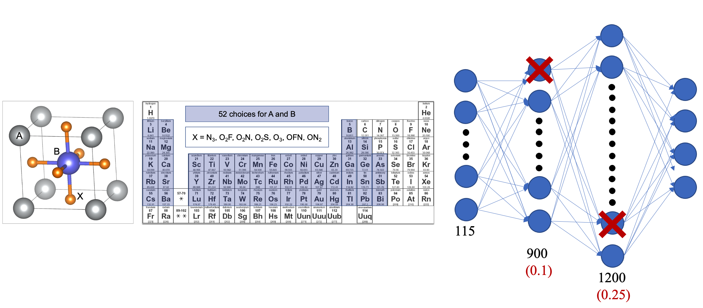

# Deep_Learning_Perovskites

Companion repo to the paper ["Deep learning the properties of inorganic perovskites"](https://iopscience.iop.org/article/10.1088/1361-651X/ac52de/meta)

Contains the trained deep learning, random forest and kernel ridge regression models along with training and test data. 

